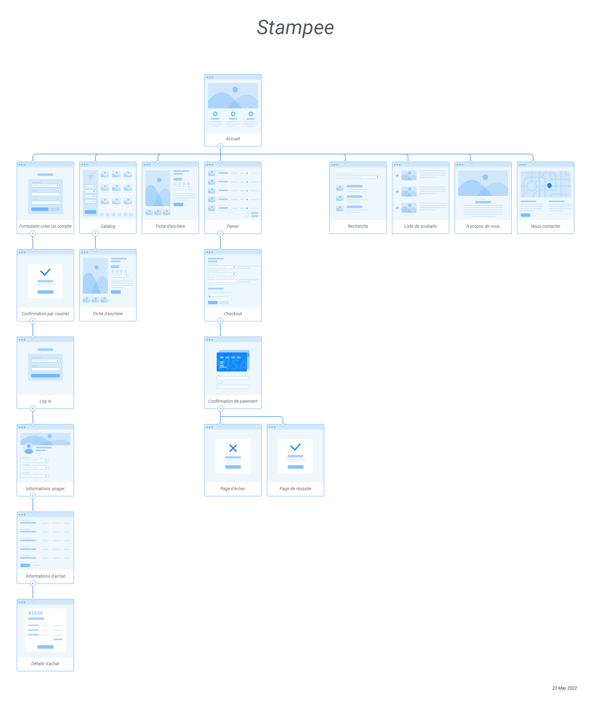

# Analyse de la plateforme d’enchères « Stampee »

## Introduction

Cette analyse a été faite par : **Alana Moraes et Claudia Lisboa**.  Nous nous sommes basés sur des sites brésiliens et internationaux pour pouvoir faire une comparaison plus large. 
Ce document représente une analyse du devis pour le Lord Reginald Stampee, duc de Worcessteshear et philatéliste depuis sa tendre enfance au milieu des années cinquante.

## Definition du projet:

### Objectifs de la plateforme

- Un projet conçu pour être accessible aux personnes âgées, qui n'ont pas l'habitude d'accéder à Internet, mais qui sont intéressées par l'achat de la collection de stampee. L'accès à la plateforme sera simple et rapide, sans trop de complexité.
- La plateforme garantit que toutes les pièces sont tarifées en fonction du marché, que l'ensemble du système d'enchères impliqué a une confidentialité totale des offres faites par les enchérisseurs et de leur identité.

### Ce qui a été compris:

- C'est un site où tout le monde peut avoir un accès visuel à ce qui est mis aux enchères, mais pour faire une enchère, vous devez avant faire le log in et tous les membres peuvent enchérir dans n'importe quelle section.
- Sur la page d'accueil, l'utilisateur a la possibilité de s'inscrire. Tout comme l'utilisateur peut rechercher l'enchère qui l'intéresse, la recherche est disponible sur la page d'accueil.
- La plateforme fournira des fonctionnalités de liste d'enchères, de filtrage et de recherche d'enchères. Ces fonctionnalités se veulent simples, le site s'adressant à des personnes, principalement, âgées qui n'ont pas l'habitude d'effectuer des transactions sur Internet.

### Navigateurs & appareils supportés (visés):

- La plateforme sera développée pour le Web, également disponible sur tablettes et téléphones portables.

## Étude de la concurrence

- Il existe des sites qui permettent aux utilisateurs d'enchérir et permettent également aux utilisateurs d'alimenter la plateforme. 
- Il existe des sites qui permettent à l'utilisateur de mettre ce qu'il veut vendre, sans que le site ne fasse de filtrage.
- Il existe des sites qui laissent les membres choisir le prix devis d'afichage et d'autres qui imposent un devis unique.

    - [MTM international](http://mtminternational.ca/fr/stamps)
    - [IArremate](https://www.iarremate.com/)
    - [Leiloes BR](https://www.leiloesbr.com.br/)
    - [Sothebys](https://www.sothebys.com/en/)

## Fonctionnalitées envisagées
   
- Créer des comptes membre: le système permettra une gestion automatique des membres qu'au premier moment vous pourrez créer un compte et dans ce compte vous aurez toutes vos informations professionnelles et toutes vos informations de crédit. Il y aura un courriel que sera envoyé, lorsqu'est la personne crée une compte elle reçoit un courriel pour confirmer (rendre cette information très claire) et valider les informations et après cela l'utilisateur pourra se connecter à son compte et à partir de ce qui est dégagé par le log in chaque utilisateur va pouvoir accéder à une certaine fonction du site.
- Trouver rapidement un encheres sur la page d'accueil: montrer toutes les enchères qui sont actuellement ouvertes et ceux qui viennent d'être terminés.
- La recherche peut se faire avec un filtre précisant ce qu'il recherche. (année des timbres, pays, enchères archivées, enchères en cours, etc...).
- Possibilité de zoomer sur chaque photo de timbre pour le vérifier comme une loupe.

## Arborescence structurelle

## Ce qu'il reste à établir

- Le site Web sera produit dans quelle langue ? Y aura-t-il des options dans d'autres langues ?
- Sera-ce uniquement pour la vente de timbres ou y aura-t-il d'autres œuvres à vendre ?

## Questions subséquentes

- Quel devis sera affiché ? Sera-ce un site international ? Serez-vous capable d'afficher la valeur dans différents types de devises ?
- Les utilisateurs seront-ils autorisés à mettre à jour automatiquement les ventes de timbres ou l'équipe sera-t-elle responsable de la sélection pour mettre à jour ?
- Les ventes peuvent-elles se faire par lots ou uniquement à l'unité ? Puis-je acheter un timbre individuel ou une collection ou les deux options ?
- Qui vend les pièces veut que son nom et ses données soient affichés ou que ce soit une vente confidentielle ?

## Pages

### Accueil

- Grande image d'entrée montrant les timbres plus populaire/cher aux enchères.
- Petite description de Lord et ses timbres
- Composants en format carte pour les timbres qui sont en vente aux enchères en ce moment « vedettes », donnant accès à saisir la fiche d'enchère.
- Composants en format carte pour les timbres qui sont recentement archivée.

### Fiche d'enchère

#### Entité « Timbre »
- Nom
- Date de création
- Couleur(s)
- Pays d’origine
- Images
- Image principale + Images supplémentaires
- Condition
    - Parfaite
    - Excellente
    - Bonne
    - Moyenne
    - Endommagé
- Tirage
- Dimensions
- Certifié
    - Oui
    - Non
- Description

#### Entité « Enchère »

- Période d’activité
- Date de début
- Date de fin
- Prix plancher
- Offre actuelle
- Prix
- Nom du membre
- Quantité de mises
- Coups de cœur du Lord

### Catalogue d’enchères

- Afficche les enchères en cours mais donne la possibilité d'afficher aussi les enchères arquivées.
- Enchères en cours (Composant en format carte: Nom + Photo + prix + date de postage + condition )
- Enchères archivées (Composant en format carte: Nom + Photo + prix + date de fin + condition)

www.flowmapp.com (Arborescence)

